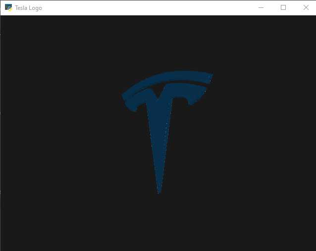

# Logo to 3D

This algorithm scans a logo and converts it into a 3D triangle mesh. 

The mesh is then displayed in a 3D viewer.

It works best if the image has a black background and the object is white.
Otherwise, the logo looks like it´s been cut out of a solid block.

The object will be displayed with a metallic material effect.

## Installation

To use this algorithm, you need to setup a new environment and install the requirements
specified in the requirements.txt file with the following command:

```
pip install -r requirements.txt
```

## Usage

To run the program, simply run the following command:

``` 
python render.py
```

## Example

The following example shows how the logo:


is converted into a 3D mesh.

